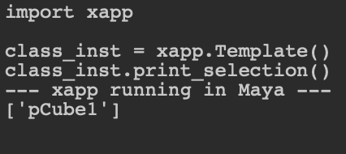
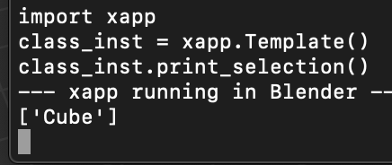

# xapp
## A template for writing app agnostic tools in Python

### Why Use xapp?
xapp is useful if you need to support a tool in multiple DCC applications, but don't want to write the same code twice.

### Expectations
1. Right now, xapp will run in Maya and Blender. You will need to extend it if there is another app you would like to run it in.
2. If running in Blender, you will need to add PySide2 to Blender's site-packages directory.

### How To Use
1. Add the xapp package to the desired app's PYTHONPATH or default scripts directory
2. Run the following lines of code:
```
import xapp
inst = xapp.run(headless = False)
```
&nbsp;



